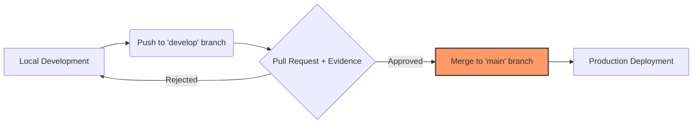

# SDLC Governance & Software Validation Framework (ISO 17025)

### Project Overview

This project documents the transition of internal software development within an **ISO/IEC 17025 accredited laboratory** from manual deployments to a structured, auditable process aligned with accreditation requirements.

The framework operates on a fundamental principle: software is treated as a critical component of the measurement process. Code changes are validated and documented to avoid the risks associated with uncontrolled deployments.

---

### 1. Context and Operational Risk

In regulated laboratories, software managing technical records requires stability and integrity. Prior to this implementation, the absence of segregated environments and the practice of editing code directly on production servers created tangible problems:

*   **Traceability Gaps:** No reliable mechanism existed to identify who changed what or when. This creates significant issues during audit assessments.
*   **Validation Risks:** Deploying updates directly to production introduced the possibility of inadvertently compromising calibration methods or analytical results.
*   **Operational Instability:** Syntax errors or runtime failures in production could halt laboratory operations entirely.

To address these vulnerabilities, a **Gitea-based system** was implemented to enforce change control and validation through architectural constraints.

> Beyond technical instability, this model created systemic organizational risk. Production continuity depended on direct human intervention, software validity relied on institutional knowledge rather than documented controls, and a single unreviewed modification could compromise both operational service and audit defensibility.

---

### 2. Infrastructure: Environment Isolation

To eliminate "hot-fixing" practices and production errors, a tiered architecture was built using **Docker Compose** and **Nginx**. This configuration enforces strict separation between development and production environments.

*   **Isolated Containers:** Each project runs in its own Docker container, allowing code testing and dependency updates without affecting production systems.
*   **Stable Deployment:** Applications transition from development runtimes to production builds served by Nginx, improving stability and reducing resource consumption.
*   **Centralized Code Management:** A dedicated **Gitea** instance manages all repositories in one location, providing a secure history for critical tools including LIMS and internal applications.

</br>

  
*(Figure 1: Centralized Repository Management)*

---

### 3. The Validated Lifecycle: Software as a Measurement Record

In an ISO 17025 context, code is handled with the same validation requirements as measurement records. Every change requires testing and documentation.



1. **Separate Branches:** All development work occurs on the `develop` branch. The `main` branch (production) is protected—direct commits are prevented.
2. **Validation Evidence:** Before deployment, code is tested in a staging environment. Logs or reports are retained as proof of functionality.
3. **Pull Requests (PR):** The PR functions as a formal "Change Control Form," requiring attached test evidence for technical review.
4. **Review and Merge:** A Technical Lead reviews both code and evidence. Upon merge, the system automatically logs the author, timestamp, and version.

---

### 4. Pragmatic Trade-offs and Risk Management

The system architecture reflects deliberate engineering decisions that balance ISO 17025 compliance with existing on-premise hardware constraints.

* **Manual Validation over Automated Testing:** Implementing comprehensive automated testing (e.g., PHPUnit) for the legacy codebase presented low return on investment and operational disruption. Instead, mandatory manual validation in a staging environment that mirrors production was enforced. This approach provides required traceability and prevents production failures while managing technical debt pragmatically.

* **Reproducibility over High Availability (HA):** Given physical server constraints, deploying a full HA Kubernetes cluster was not feasible. Risk mitigation is achieved through Docker containerization and automated daily backups, prioritizing deterministic recovery over hardware redundancy.

---

### 5. Mapping: ISO 17025 vs. Technical Practice

The following table illustrates how quality laboratory requirements translate into specific engineering practices:

| ISO 17025 Requirement                | Technical Implementation                       |
| :----------------------------------- | :--------------------------------------------- |
| **Document & Record Control**        | Version-controlled Git repositories.           |
| **Modification History**             | Git Log & Blame (Who, When, What).             |
| **Change Request**                   | Formal Pull Request (PR).                      |
| **Objective Evidence of Validation** | Functional logs or reports attached to the PR. |
| **Authorization of Changes**         | Peer Review and final merge to `main`.         |
| **Data Integrity Protection**        | Environment segregation (Develop vs. Main).    |

---

### Summary of Impact

The transition from manual deployments to this structured SDLC improved the laboratory's technical stability across three key areas:

1. **Audit Readiness:** All changes to critical code are now fully traceable, meeting requirements for accreditation assessments.
2. **Operational Resilience:** Environment segregation and mandatory validation stages structurally reduced the risk of production failures caused by unvalidated changes.
3. **Sustainable Maintenance:** Centralized code management in Gitea and Docker-based recovery strategies reduced dependence on institutional knowledge, improving system maintainability.

```
```
