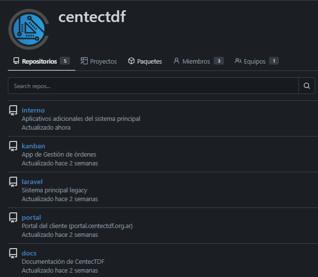

  
<strong>Versión en español:</strong>
  

  
  # ISO 17025 Software Development Lifecycle (SDLC)

Este repositorio documenta la metodología implementada en el **Centro de Desarrollo Tecnológico de Tierra del Fuego (CENTEC TDF)** para alinear el desarrollo de software interno con los requisitos de la norma **ISO/IEC 17025**.

Como responsable del área, mi prioridad fue profesionalizar el desarrollo: pasamos de una programación artesanal a un flujo de trabajo controlado, auditable y validado, alineado con las exigencias de la norma.

## El Contexto y la Problemática

Como laboratorio acreditado bajo ISO 17025, debemos garantizar la integridad de los datos, la validación de los métodos y el control de los documentos.

**La situación previa:**
Anteriormente, los cambios se aplicaban directamente sobre los servidores de producción (Hot-fixing). Esta falta de ambientes intermedios generaba riesgos críticos: imposibilidad de auditar cambios y peligro latente de interrumpir la operación del laboratorio ante un error de sintaxis.
Si bien esto permitía agilidad, un cambio no validado ponía en riesgo la validez técnica de los ensayos del laboratorio:
* **Falta de Trazabilidad:** No existía un historial claro de quién modificó qué y cuándo.
* **Ausencia de Validación:** Los cambios impactaban al usuario final sin una etapa formal de pruebas.
* **Riesgo Operativo:** Un error de sintaxis podía detener la operación del laboratorio.

## La Solución: flujo de ramas controlado

Para cumplir con el requisito de **Control de Cambios** y **Validación de Software**, implementamos un ecosistema basado en Gitea que obliga a la segregación de entornos.

### Estrategia de Ramas (Branching Model)
Se definieron dos ramas persistentes para todos los proyectos (Internos, Portal y Kanban):

1.  **`main` (Producción):** Contiene únicamente código validado, estable y aprobado. **Nadie tiene permisos para escribir directamente aquí.** Es la "Fuente de la Verdad".
2.  **`develop` (Desarrollo/Staging):** Es el entorno de integración donde los desarrolladores envían sus cambios para ser probados.

---

## El Procedimiento de Gestión de Cambios

Para asegurar el cumplimiento, se estableció el siguiente flujo de trabajo obligatorio:

### 1. Desarrollo Seguro
El desarrollador nunca toca el entorno de producción. Trabaja localmente o en el servidor de pruebas, impactando sus cambios exclusivamente en la rama `develop`.

### 2. Generación de Evidencia (Validación)
Antes de solicitar la puesta en marcha, el desarrollador debe realizar pruebas funcionales en el entorno de desarrollo.
* **Requisito ISO:** Se debe generar una **evidencia objetiva** (captura de pantalla, log o reporte) que demuestre que el cambio funciona según lo esperado y no rompe funcionalidades previas.

### 3. Solicitud de Cambio (Pull Request)
El desarrollador abre un **Pull Request (PR)** en Gitea desde `develop` hacia `main`.
* El PR actúa como el **Formulario de Control de Cambios**.
* Debe incluir la evidencia de funcionamiento adjunta.

### 4. Revisión y Aprobación
Un Responsable Técnico (distinto al ejecutor, cuando es posible) revisa el código y la evidencia.
* Si cumple los requisitos, realiza el **Merge** (fusión).
* Gitea registra automáticamente: **Responsable**, **Fecha** y **Versión** del cambio.

### 5. Despliegue Controlado
Solo una vez aprobado el Merge, los servidores de producción actualizan su código desde la rama `main`.

---

## Equivalencia: Norma vs. Implementación

Este cuadro resume cómo traducimos el lenguaje de la norma ISO 17025 a terminología de desarrollo:

| Concepto ISO 17025 | Implementación en Gitea/Git |
| :--- | :--- |
| **Control de Documentos** | Repositorio Versionado (Git) |
| **Historial de Cambios** | Git Log & Blame |
| **Solicitud de Modificación** | Pull Request (PR) |
| **Evidencia de Validación** | Screenshots/Logs adjuntos al PR |
| **Autorización** | Merge a rama `main` |
| **Segregación de Entornos** | Ramas `develop` vs `main` |

---

## Arquitectura del Sistema

El ecosistema se compone de 5 repositorios gestionados bajo esta política:

1.  **Laravel:** Sistema principal del Laboratorio
2.  **Internos (Legacy PHP):** Aplicativos adicionales del sistema principal.
3.  **Portal (Web):** Interfaz de clientes.
4.  **Kanban (Docker):** Aplicativo de gestión de órdenes de servicio.
5.  **Docs (MkDocs):** Documentación de procedimientos internos.

*(Vista del panel de control de repositorios en el servidor interno)*

---

## Oportunidades de mejora continua

Este proyecto prioriza la **trazabilidad y el control humano** por sobre la automatización total, adecuándose a la realidad de un equipo de infraestructura y recursos de hardware limitados.

A continuación, se detallan las decisiones de diseño, lo que **NO** se implementó y la proyección a futuro.

1.  **Ausencia Testing Automático (Unit Tests):**
    * **Estado actual:** Priorizamos el control de cambios sobre la automatización total debido a la estructura del equipo.
    * **Por qué:** Refactorizar el código *Legacy* para hacerlo testeable (PHPUnit) excedía el tiempo disponible.
    * **Ideal:** Un sistema automático que rechace los cambios si no tienen pruebas de código suficientes.

2.  **Infraestructura sin Alta Disponibilidad (HA):**
    * **Estado actual:** Si el servidor físico falla, el servicio se detiene.
    * **Por qué:** Limitación de hardware On-Premise. Se mitiga con virtualización (Docker) y backups diarios para recuperación rápida y reproducibilidad. Sabemos que no es una infraestructura de misión crítica, pero con Docker y backups diarios garantizamos un RTO (Recovery Time Objective) aceptable para el laboratorio.
    * **Ideal:** Cluster Kubernetes con redundancia de nodos.

3.  **Seguridad Manual:**
    * **Estado actual:** No hay escaneo estático de vulnerabilidades (SAST) en el pipeline.
    * **Por qué:** Los recursos del servidor no soportan herramientas pesadas como SonarQube en tiempo real.
    * **Ideal:** Servidor dedicado para análisis de seguridad automatizado.

 

  
<strong>English version:</strong>
  

# ISO 17025 Software Development Lifecycle (SDLC)

This repository documents the methodology implemented at the **Centro de Desarrollo Tecnológico de Tierra del Fuego (CENTEC TDF)** to align internal software development with **ISO/IEC 17025** standards.

As the Technical Lead, my primary objective was to transform ad-hoc programming processes into a controlled, auditable, and validated workflow.

## The Context & The Challenge

As an ISO 17025 accredited laboratory, we must guarantee data integrity, method validation, and document control.

**The Previous Situation:**
Historically, software development within the laboratory was performed by editing code directly on production servers ("Hot-fixing"). While agile, an unvalidated change jeopardized the technical validity of the laboratory tests:

* **Lack of Traceability:** There was no clear history of who changed what or when.
* **Lack of Validation:** Changes impacted end-users without a formal testing stage.
* **Operational Risk:** A simple syntax error could halt laboratory operations.

## The Solution: Controlled Branching Model

To comply with **Change Control** and **Software Validation** requirements, we implemented a Gitea-based ecosystem that enforces environment segregation.

### Branching Strategy
Two persistent branches were defined for all projects (Internal Apps, Portal, and Kanban):

1.  **`main` (Production):** Contains only validated, stable, and approved code. **No one has direct write access.** It is the "Single Source of Truth."
2.  **`develop` (Development/Staging):** The integration environment where developers push changes for testing.

---

## Change Management Procedure

To ensure compliance, the following mandatory workflow was established:

### 1. Secure Development
Developers never touch the production environment. Work is performed locally or on the test server, pushing changes exclusively to the `develop` branch.

### 2. Evidence Generation (Validation)
Before requesting deployment, developers must perform functional tests in the development environment.
* **ISO Requirement:** **Objective evidence** (screenshot, log, or report) must be generated to demonstrate that the change works as expected and does not break existing functionality.

### 3. Change Request (Pull Request)
The developer opens a **Pull Request (PR)** in Gitea from `develop` to `main`.
* The PR acts as the formal **Change Control Form**.
* It must include the attached functional evidence.

### 4. Review & Approval
A Technical Lead (different from the executor, whenever possible) reviews the code and evidence.
* If requirements are met, the **Merge** is performed.
* Gitea automatically records the **Author**, **Date**, and **Version** of the change.

### 5. Controlled Deployment
Only after the Merge is approved do production servers update their code from the `main` branch.

---

## Mapping: Standard vs. Implementation

This table summarizes how ISO 17025 terminology translates into our development workflow:

| ISO 17025 Concept | Implementation in Gitea/Git |
| :--- | :--- |
| **Document Control** | Versioned Repository (Git) |
| **Change History** | Git Log & Blame |
| **Modification Request** | Pull Request (PR) |
| **Validation Evidence** | Screenshots/Logs attached to PR |
| **Authorization** | Merge to `main` branch |
| **Environment Segregation** | `develop` vs `main` branches |

---

## System Architecture

The ecosystem consists of 5 repositories managed under this policy:

1.  **Laravel:** Main Laboratory System.
2.  **Internos (Legacy PHP):** Additional modules for the main system.
3.  **Portal (Web):** Client Interface.
4.  **Kanban (Docker):** Service Order Management App.
5.  **Docs (MkDocs):** Internal procedures documentation.

*(View of the repository control panel on the internal server)*

---

## Continuous Improvement Opportunities

This project prioritizes **traceability and human control** over full automation, tailored to the reality of a solo-practitioner environment with limited hardware resources.

Below are the design decisions, what was **NOT** implemented, and the future roadmap.

1.  **Absence of Automated Testing (Unit Tests):**
    * **Reality:** Validation is manual within the testing environment.
    * **Why:** Refactoring *Legacy* code to make it testable (PHPUnit) exceeded available time resources.
    * **Ideal:** An automated system that rejects changes lacking sufficient code coverage.

2.  **Infrastructure without High Availability (HA):**
    * **Reality:** If the physical server fails, the service stops.
    * **Why:** On-Premise hardware limitations. Risk is mitigated via virtualization (Docker) and daily backups for rapid recovery and reproducibility.
    * **Ideal:** Kubernetes Cluster with node redundancy.

3.  **Manual Security:**
    * **Reality:** No Static Application Security Testing (SAST) in the pipeline.
    * **Why:** Server resources cannot support heavy tools like SonarQube in real-time.
    * **Ideal:** Dedicated server for automated security analysis.

  

